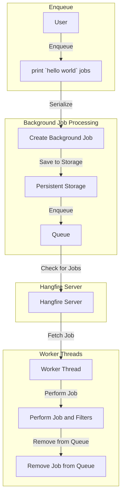

In modern web applications, handling time-consuming tasks asynchronously is crucial to providing a responsive user experience. One powerful tool for managing background job processing in .NET applications is Hangfire. In this blog post, we'll explore the basics of Hangfire and how it simplifies the implementation of background tasks.

## Getting Started

Hangfire provides a straightforward way to execute background tasks using a fire-and-forget approach. Let's look at a quick example:

```csharp
BackgroundJob.Enqueue(() => Console.WriteLine("Hello, world!"));
```

In this example, BackgroundJob.Enqueue is used to queue a background job that prints "Hello, world!" to the console. The job is not executed immediately; instead, it goes through a serialization process and is stored persistently.

## The Hangfire Workflow

Hangfire operates on a workflow that involves the following key components:

1. **Enqueuing Jobs:**
   - Jobs are enqueued using `BackgroundJob.Enqueue`.
   - The method and its arguments are serialized, creating a background job.
2. **Persistent Storage:**
   - The serialized job information is stored in a persistent storage (e.g., a database).
3. **Hangfire Server:**
   - The Hangfire Server continually checks the persistent storage for enqueued jobs.
   - It performs the jobs in a reliable way, ensuring they are executed even if the process is terminated during execution.
4. **Worker Threads:**
   - Enqueued jobs are handled by a dedicated pool of worker threads.
   - Each worker fetches, performs, and removes jobs from the queue.
5. **Guaranteed Processing:**
   - Jobs are only removed from the queue after successful processing.
   - Hangfire includes compensation logic to guarantee the processing of each job.

`BackgroundJob.Enqueue(() => Console.WriteLine("Hello, world!"))`



## Benefits of Hangfire

Hangfire offers several advantages for background job processing:

- **Simplicity:** Enqueuing jobs is as simple as passing a lambda expression.
- **Reliability:** Jobs are processed reliably, even in the face of process terminations.
- **Asynchronous Execution:** Background tasks can be executed asynchronously, improving application responsiveness.
- **Monitoring and Management:** Hangfire provides a dashboard for monitoring and managing background jobs.